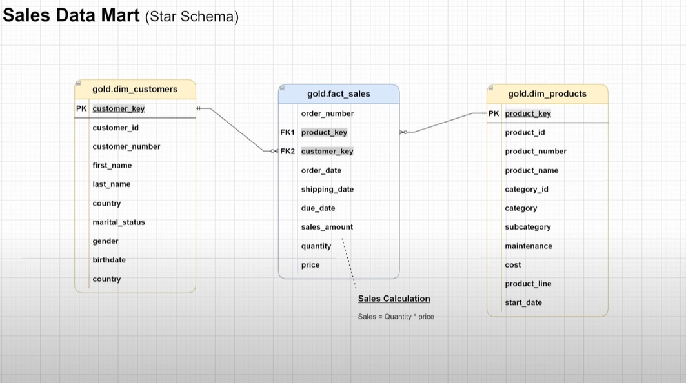

# 🧠 Data Warehouse & Analytics System  
Welcome to my Data Warehouse & Analytics project! 🚀  
This repository demonstrates the complete process of building a **modern data warehouse** — from ingesting raw data to preparing analytics-ready datasets.  
It’s designed both as a **portfolio project** as a **practical learning resource** for anyone interested in data engineering.

---

## 🏗️ Data Architecture

The project follows the **Medallion Architecture** — a layered approach that organizes data flow through **Bronze**, **Silver**, and **Gold** layers:

| Layer | Description |
|--------|--------------|
| 🥉 **Bronze Layer** | Stores raw data extracted directly from source systems (CSV files). Data is loaded as-is into the SQL database. |
| 🥈 **Silver Layer** | Responsible for data cleaning, validation, normalization, and resolving duplicates or missing values. |
| 🥇 **Gold Layer** | Contains curated, business-ready data modeled in a **Star Schema**, used for analytics and reporting. |

📊 *This structure ensures scalability, transparency, and efficient data transformations.*

---

## 📖 Project Overview

This project demonstrates a realistic end-to-end data warehouse pipeline including:

- **Data Modeling:** Designing fact and dimension tables optimized for analytical queries.  
- **ETL Pipeline:** Extracting data from CRM and ERP sources, transforming it in Silver Layer, and loading it into Gold Layer.  
- **Data Quality Management:** Handling duplicates, invalid values, and type casting.  
- **Analytics & Reporting:** Providing sales, customer, and product insights directly from SQL queries.  
- **Documentation:** Including Data Catalogs, testing scripts, and visual diagrams.

---

## 🎯 Project Goals

The main objective is to develop a **centralized data warehouse** capable of delivering **clean, consistent, and analytics-ready** data to support business decisions.

### 💡 Focus Areas:
- Customer behavior analysis  
- Product performance tracking  
- Sales performance and trend insights  
- Data consistency and referential integrity  

---

## 🛠️ Technologies & Tools

| Category | Tools Used |
|-----------|-------------|
| **Database** | PostgreSQL |
| **Development** | SQL, Views, Joins, CASE, Window Functions |
| **Documentation** | Markdown (.md), Notion |
| **Version Control** | Git, GitHub |
| **Testing & Validation** | SQL Test Scripts, Data Profiling Queries |

---

## 📂 Repository Structure

```
data-warehouse/
│
├── datasets/                     # Raw source data (ERP, CRM)
│
├── docs/                         # Documentation & architecture files
│   ├── data_catalog.md            # Dataset catalog and metadata
│
├── scripts/                      # SQL transformation scripts
│   ├── bronze/                    # Raw data ingestion
│   ├── silver/                    # Cleaning & normalization
│   ├── gold/                      # Star schema and analytics views
│
├── tests/                        # Data quality and validation scripts
│
├── README.md                     # Project overview
└── LICENSE                       # License information
```

---

## 🚀 Getting Started

### 🧩 Requirements:
- PostgreSQL (Express or Developer edition)
- Git (to clone and version the project)

### ⚙️ Steps to Run:
1. Clone the repository:  
   ```bash
   git clone https://github.com/yourusername/data-warehouse.git
   ```
2. Restore or create the SQL database.  
3. Run scripts in order:
   - `bronze/` → `silver/` → `gold/`  
4. Verify the views in Gold Layer (`dim_customer`, `dim_products`, `fact_sales`).
5. Explore data with SQL queries or connect to a BI tool (Power BI, Tableau).

---

## 📊 Data Model (Star Schema)

 

## 🧪 Data Quality Checks

Each layer includes SQL-based validation tests:
- Check for null or invalid keys  
- Validate data types and constraints  
- Detect duplicates and inconsistencies  
- Ensure referential integrity between fact and dimension tables  

---

## 🌐 Use Cases

This project is useful for:
- **Employers / Recruiters:** Demonstrates solid understanding of SQL, ETL logic, and data modeling.  
- **Students & Learners:** Example of a complete Medallion Data Warehouse architecture.  
- **Analysts / Engineers:** Ready-to-adapt structure for analytics automation and BI integration.  

---

## ☕ About Me

Hi, I’m **Aleksey**, a passionate **Data Engineer** and **3D Artist turned tech enthusiast**.  
I love building efficient data systems, automating workflows, and learning new technologies every day.

If you find this project useful or interesting — ⭐ **star the repo** and feel free to connect with me!

---

## 🛡️ License

This project is licensed under the **MIT License** — you are free to use, modify, and share it with proper attribution.

---

### 🤝 Connect with Me
- 💼 [LinkedIn](https://www.linkedin.com/in/belyaevaleksey/)  
- ✉️ Email: AlekseyBA07@gmail.com

> _“Data isn’t just numbers — it’s the story behind every decision.”_
